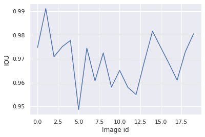
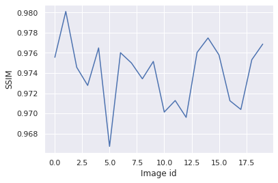
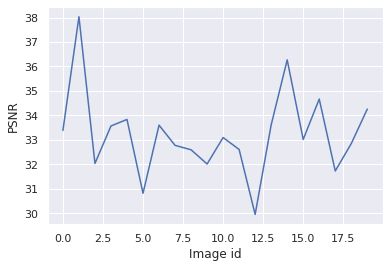

**``` Authors: Sumit Pandey and Prof. Kuan-Fu Chen```**

In This research project, we developed a Pix2Pix GAN based software to detect the `abdominal aorta`. During this project we completed these steps:
- Collected total ```785 Ultra-Sound images``` from multiple subjects. 
-  ```Labeled and prepare segmentation``` the images under expert supervision.
- ```Pre-process``` (Normalize and resize) the images. 
-  train and validate the model over multiple machine-learning and deep-learning based algorithm including .


# Libraries:
-----------------------------------------------------------------
``` python 
pip install gradio
pip install tensorflow 
pip install keras 
pip install matplotlib 
pip install pandas # numpy will be installed autimaticallly 


import numpy 
import tensorflow 
import keras
import matplotlib.pyplot as plt
import glob 
import keras 

```

# Models used: 
we compared two models (UNet, Pix2Pix GAN) in this work and finally selected the best performance model (Pix2Pix GAN). 


# Software Demo 
-----------------------------------------------------------------
Here is the software demonstration, this software will be upgraded with time. The web based 


# Pix2Pix GAN model perfromance: 
-----------------------------------------------------------------
We compared all 5 models over 20 testing images here are the results:

Figure 1: This figure shows the graph between  SSIM (Structure Similerity Index Measure) and image number (test image id). 


Figure  2: This figure shows the graph between IOU (Intersection over Union) and image number (test image id).


Figure  3: This figure shows the graph between PSNR (Peak signal-to-noise ratio) and image number (test image id).


based on above results, we finally selected the best model and here are the results:


### GAN training data results:


  

### GAN validation data results: 

  


### GAN test data results:


  


--------------------------------------------------------------
_The dataset, complete code (training and testing) will be open sourced after publishing the paper_

--------------------------------------------------------------
